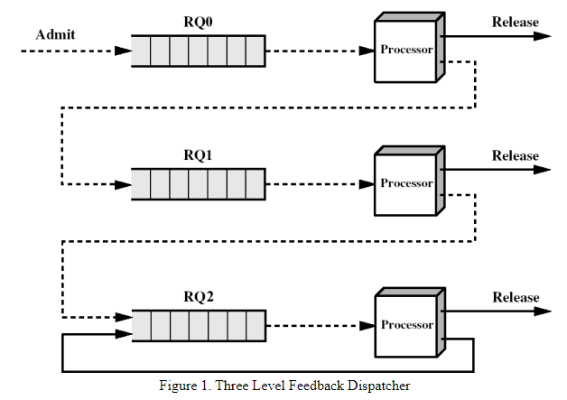

# README

## Introduction

该项目使用C语言编写了实现操作系统常用内存分配算法的内存管理模拟器（DISPATCHER），其接受虚拟的进程内存表，同时给出可视化的调度结果。

在这里，项目实现的算法是四优先级进程调度器，该算法实际上融合了FIFO、时分轮转算法、最短完成时间任务优先等常用内存分配算法。此外，项目同时考虑到了操作系统的其他硬件资源，如光驱、打印机等。

最终应实现的模拟器抽象如图所示：

由于该项目使用了linux系统的系统调用等C函数库，因此仅能在linux系统中运行。

在项目文件夹中，`program-test`中包含了程序测试相关代码，`src`文件夹中则是程序的基本代码框架和引用资源。`Document.pdf`文件中包含了该项目所完成的要求等内容，`README`则展示了我从本次项目中主要掌握到的知识以及相关感悟。
