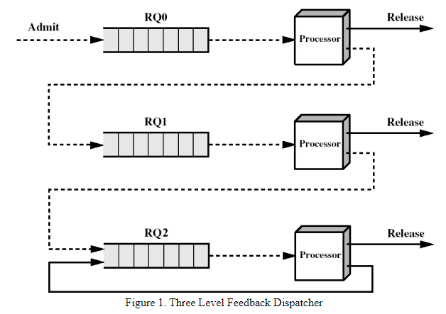

# README

## Introduction

This project is actually a lab in my course `Operating Systems`. This project writes memory management simulator (DISPATCHER) in C that implements common memory allocation algorithms for operating systems, which accepts virtual process memory tables and also gives visual scheduling results. This is a practical homework project for my operating systems course. 

Here, the algorithm implemented in the project is a four-priority process scheduler, which actually incorporates common memory allocation algorithms such as FIFO, time division rotation algorithm, and shortest completion time task priority. In addition, the project also takes into account other hardware resources of the operating system, such as optical drives, printers, and so on.

The final simulator abstraction that should be implemented is shown in Fig:

Since the project uses C libraries such as system calls for linux, it will only run in linux.

In the project folder, `program-test` contains the code related to testing the program, and the `src` folder contains the basic code framework and referenced resources for the program. The `Document.pdf` file contains the requirements, etc. that were completed for the project, and the `README` shows the main knowledge that I have acquired from this project and the related thoughts.Actually, it can be seen as a kind of Summary report.

